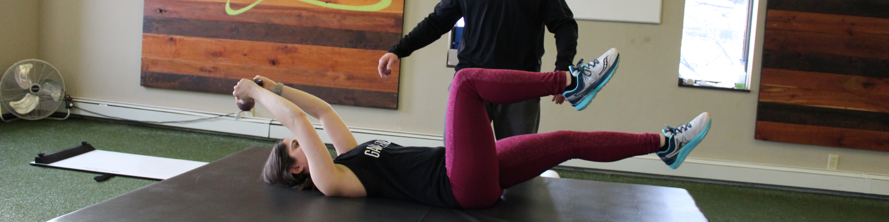

# MIK GYM - Gym Management SaaS Platform



A comprehensive Gym Management System built with Django, designed to streamline gym operations with trainer assignments, subscription management, and a modern web interface.

## 📋 Project Overview

Arnold GYM is a full-featured SaaS (Software as a Service) platform for managing gym operations. It enables gym administrators to manage trainers, members, subscriptions, and services efficiently while providing members with a seamless experience for enrolling in programs and connecting with personal trainers.

## ✨ Features

### For Members

- **User Authentication** - Secure login and registration system
- **Service Browsing** - Explore available fitness services (Cardio, Body Building, Dancing, etc.)
- **Subscription Plans** - Choose from multiple membership tiers:
  - Basic ($150/month) - Exercise Schedule, Diet Plan
  - Medium ($250/month) - Trainer Guidance + Basic Features
  - Advance ($350/month) - Full Personalized Training + All Features
- **Trainer Discovery** - Browse and connect with certified trainers
- **Gallery** - View gym facilities and member progress photos
- **FAQ Section** - Common questions and support resources
- **Enquiry Form** - Contact gym for custom inquiries

### For Administrators

- **Trainer Management** - Add, update, and manage trainer profiles
- **Client-Trainer Assignment** - Assign trainers to clients based on needs
- **Subscription Tracking** - Monitor member subscriptions and renewals
- **Service Management** - Create and manage fitness services offered
- **Analytics Dashboard** - View gym performance metrics
- **Content Management** - Update services, FAQs, and gallery content

## 🛠 Tech Stack

### Backend

- **Django** - Web framework for rapid development
- **PostgreSQL** - Robust database (psycopg2)
- **Celery** - Asynchronous task queue
- **Redis** - In-memory data store for caching and task queue broker


### Frontend

- **HTML5** - Semantic markup
- **CSS3** - Responsive styling
- **Bootstrap 5** - Modern UI framework
- **JavaScript** - Interactive functionality
- **jQuery** - DOM manipulation

### Additional Tools

- **Pillow** - Image processing
- **CKEditor** - Rich text editing for content
- **Cloudinary** - Cloud-based image storage and CDN
- **Django Debug Toolbar** - Development debugging
- **Django Extensions** - Useful utilities and commands

## 📦 Installation

### Prerequisites

- Python 3.8+
- PostgreSQL
- Redis
- pip/virtualenv

### Setup Steps

1. **Clone the repository**

   ```bash
   git clone <repository-url>
   cd GYM-Mgt
   ```

2. **Create and activate virtual environment**

   ```bash
   python -m venv .venv
   source .venv/bin/activate  # On Windows: .venv\Scripts\activate
   ```

3. **Install dependencies**

   ```bash
   pip install -r requirements.txt
   ```

4. **Set up environment variables**

   ```bash
   cp .env.example .env
   # Edit .env with your database, Cloudinary, and other credentials
   ```

5. **Run migrations**

   ```bash
   python manage.py migrate
   ```

6. **Create superuser**

   ```bash
   python manage.py createsuperuser
   ```

7. **Run development server**

   ```bash
   python manage.py runserver
   ```

8. **Start Celery (in another terminal)**

   ```bash
   celery -A config worker -l info
   ```

9. **Start Celery Beat (in another terminal)**
   ```bash
   celery -A config beat -l info
   ```

Access the application at `http://localhost:8000`

## 🚀 Usage

### Admin Panel

1. Navigate to `/admin`
2. Login with superuser credentials
3. Manage Trainers, Clients, Subscriptions, and Services

### Member Portal

1. Visit home page at `/`
2. Browse services and pricing plans
3. Register/Login to your account
4. Choose a subscription plan
5. Request trainer assignment
6. Access your dashboard

### Key URLs

- **Home** - `/` - Main landing page
- **Gallery** - `/gallery/` - View gym facilities
- **Pricing** - `/pricing/` - Subscription plans
- **Services** - `/services/` - Available services
- **Enquiry** - `/enquiry/` - Contact form
- **Login** - `/login/` - User authentication
- **FAQ** - `/faq/` - Frequently asked questions
- **Admin** - `/admin/` - Administration panel

## 📊 Database Schema

### Core Models

- **User** - Extended Django user model for members
- **Trainer** - Trainer profiles with specializations
- **Service** - Available gym services
- **Subscription Plan** - Membership tiers and pricing
- **Membership** - User subscription records
- **TrainerAssignment** - Link between trainers and clients
- **Gallery** - Photo galleries for gym

## 🔐 Security Features

- CSRF protection on all forms
- Password hashing with Django's default system
- SQL injection prevention via ORM
- Secure file uploads with Cloudinary
- Environment-based configuration for sensitive data
- Debug toolbar disabled in production

## 📧 Email Notifications

The platform auto-sends emails for:

- New subscription confirmations
- Trainer assignment notifications
- Membership renewal reminders (via Celery Beat)
- Enquiry acknowledgments

## 🤝 Contributing

1. Create a new branch for your feature

   ```bash
   git checkout -b feature/your-feature-name
   ```

2. Commit your changes

   ```bash
   git commit -m "Add your commit message"
   ```

3. Push to your branch

   ```bash
   git push origin feature/your-feature-name
   ```

4. Create a Pull Request

## 📄 License

This project is licensed under the **MIT License** - see the [LICENSE](LICENSE) file for details.

## 📞 Support

For issues, questions, or feature requests, please open an issue on the repository or contact the development team.

## 🙋 Authors

- **Development Team** - Initial development and maintenance

---

**MIK GYM** - Transform Your Fitness Journey 💪
